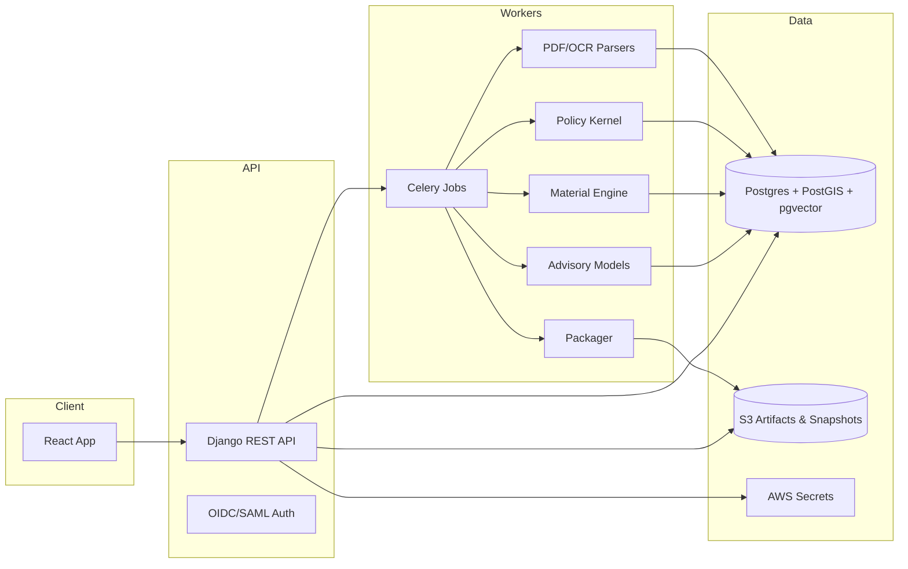

# RegulAgent Platform Architecture & Implementation Plan

**Purpose:** Design a production-ready, self-learning (user- and regulator-aware) platform that generates *deterministic, compliant* well plugging plans and filings (e.g., W‑3A) while continuously improving recommendations via trends across state, district, formation, radius, operator, and user preferences.

---

## Table of Contents
1. [Guiding Principles](#guiding-principles)
2. [Operating Modes](#operating-modes)
3. [High-Level Architecture](#high-level-architecture)
4. [Data Ingestion & Parsing](#data-ingestion--parsing)
5. [Canonical Data Model](#canonical-data-model)
6. [Deterministic Policy Kernel](#deterministic-policy-kernel)
7. [Material Usage Engine](#material-usage-engine)
8. [Learning Layer (Advisory)](#learning-layer-advisory)
9. [Similarity Search & Templates](#similarity-search--templates)
10. [Packaging & Submission](#packaging--submission)
11. [API, Orchestration, and Frontend](#api-orchestration-and-frontend)
12. [Security, Privacy, and Governance](#security-privacy-and-governance)
13. [Observability & Metrics](#observability--metrics)
14. [Testing Strategy](#testing-strategy)
15. [Deployment & Infra](#deployment--infra)
16. [Milestones (Build Order)](#milestones-build-order)
17. [Starter Backlog](#starter-backlog)
18. [Appendices](#appendices)
19. [Human + Agentic Workflow & LLM Sanity Checks](#human--agentic-workflow--llm-sanity-checks)
20. [ML & LLM System Design (Self-Learning, Tenant-Safe)](#ml--llm-system-design-self-learning-tenant-safe)
21. [Public Core vs Tenant Overlay Alignment](#public-core-vs-tenant-overlay-alignment)

---

## Guiding Principles

- **Deterministic core; learning assists.** The rules/policy kernel *always* produces a compliant baseline plan. The learning layer suggests, ranks, and warns—never overrides compliance.
- **Provenance-first.** Every field has source, timestamp, parser version, coordinates (page/bbox), and confidence.
- **Config over code.** State/district/user overlays live in versioned policy packs (YAML/JSON) reviewed via PR + regression tests.
- **Explainability.** Every step and material number has an audit trail: formulas, inputs, yields, excess factors, rounding rules.
- **Tenant isolation.** Cross-tenant learning is **opt-in** only; data is isolated at storage and model levels.
- **Idempotency and reproducibility.** Each run is keyed by API number + source snapshot; results are hashed with kernel/overlay versions.

---

## Operating Modes

All modes share the same pipeline; they differ only in **source weighting** and reconciliation policy.

1. **Basic (Upload-Only)**  
   Upload PDFs/images. Parsed data is authoritative unless blocked by validation.

2. **RRC-Only (Sole Retrieval)**  
   System fetches data from RRC and other public sources. Those become primary.

3. **Hybrid (Enterprise)**  
   Combine uploads + RRC. Conflicts are reconciled deterministically with material-field blockers (e.g., operator mismatch).

**Implementation:** A `SourcePolicy` profile on the job request configures weights, blockers, and tie-breakers.

---

## High-Level Architecture



**Why this works:** Minimal components, strong isolation of concerns, and all math resides server-side for auditability.

---

## Data Ingestion & Parsing

**Connectors**
- RRC portal via Playwright (headless), with credential isolation and session sandboxing.
- Other sources (REST/CSV) as needed.
- S3 multipart uploads for user-provided PDFs/images.

**Parsing Stack**
- `pdfplumber`, `PyMuPDF` for text + layout (fast path).
- `Camelot`/`Tabula` for table extraction on tabular pages.
- `pytesseract` (Tesseract OCR) for scanned PDFs/images. Swap selectively to Textract/Vision later if ROI warrants.

**Normalization**
- Map fragments to typed Pydantic models with: value, units, confidence, page, bbox, parser_version, `source_id`.
- Unit conversions centralized (depth, diameters, bbl/ft, ft³/sk).

**Quality Gates (GE-like)**
- Field-level checks per form type (ranges, units, completeness).
- Parser scorecard (precision/recall) tracked per document class and parser version.
- Material field conflicts (operator, district, depths) create reconciliation tasks.

**Storage**
- **S3:** raw artifacts (content-hash keys), thumbnails, packaged filings.
- **Postgres (RDS):** normalized extractions, canonical facts, plans, steps, submissions, features, templates.
- **Snapshots:** lake-format Parquet in S3 (optional) for offline analytics.

---

## Canonical Data Model

> Key tables only; extend as needed.

- `wells(id, api, state, district, latlon, formations[])`
- `artifacts(id, well_id, type, s3_url, hash, uploaded_by, uploaded_at)`
- `extractions(artifact_id, key, value, units, confidence, page, bbox, parser_version, source)`
- `canonical_facts(well_id, key, value, units, confidence, provenance[])`
- `plans(id, well_id, mode, kernel_version, overlay_version, slurry_catalog_version, created_by)`
- `plan_steps(plan_id, seq, step_type, top_ft, bottom_ft, tool, cement_class, sacks, water_bbl, additives_json, regulatory_basis[])`
- `submissions(plan_id, submitted_at, status, regulator_notes[], reasons[])`
- `templates(id, district, formation_signature, archetype_json, performance_metrics)`
- `features(well_id, ts, vector, feature_json)`
- `user_prefs(tenant_id, user_id, knob, value, confidence)`

**Provenance** lives with both `extractions` and `canonical_facts` (arrays of source fragments possible).

---

## Deterministic Policy Kernel

- **Inputs:** `canonical_facts`
- **Outputs:** `Plan` + ordered `PlanStep[]` with **regulatory_basis[]** (citations + overlay references)
- **Structure:**
  - Base rules for state (e.g., SWR-14) implemented as pure functions.
  - District overlays in YAML/JSON (effective-dated).
  - Operator/user preferences applied *only* where rules allow degrees of freedom.
- **Traceability:** Each step shows *why* it exists, which fact triggered it, and the policy clause used.

**Policy Pack Example**
```yaml
version: "tx-w3a-2025.09"
state: "TX"
district_overlays:
  "08":
    prefer_bridge_plug_cap: true
    open_hole_excess_default: 0.6   # +60%
    cased_hole_excess_default: 0.4  # +40%
    squeeze_factor_default: 1.5
    min_surface_cap_ft: 100
```

---

## Material Usage Engine

**Goal:** For each step, compute **cement/spacer/additives** deterministically from geometry, interval, and slurry recipe.

### Inputs
- **Geometry by depth segment:** casing ID, stinger OD/ID, hole diameter (bit or caliper), eccentricity/standoff if known.
- **Step definition:** type (balanced plug, bridge plug + cap, squeeze via perf/retainer, shoe/surface), interval `[top, bottom]`, stinger info, policy knobs (excess, squeeze multiple, spacer strategy).
- **Slurry recipe:** density (ppg), **yield (ft³/sk)**, water (gal/sk), and per-sack additives list.

### Core Formulas (unit-safe)
- Cylinder capacity (bbl/ft): `C(d) = 0.000971 * d²`  *(d in inches)*
- Annular capacity (bbl/ft): `Ca(hole, pipe) = 0.000971 * (hole² − pipe²)`
- Inside capacity (bbl/ft): `Ci(ID) = 0.000971 * ID²`
- bbl → ft³: `1 bbl = 5.6146 ft³`
- Sacks: `sacks = ceil( (bbl * 5.6146) / yield_ft3_per_sk )`

**Excess (policy, data-driven)**
- Cased annulus: +30–50%
- Open hole (no caliper): +50–100%
- Open hole (with caliper): +10–30%
- Squeeze volumes: 100–300% of interval annulus (gated by pressure plan)

**Balanced Spot Plug**
- For plug length `L`: `total_bbl = (L * Ca * (1+excess_ann)) + (L * Ci)` (excess applied to annulus only)

**Bridge Plug + Cap**
- `cap_bbl = cap_length * Ca(casing_ID, stinger_OD) * (1+excess_cased)`

**Squeeze via Perf/Retainer**
- `base_bbl = interval_len * Ca(casing_ID, stinger_OD)`
- `total_bbl = base_bbl * squeeze_factor` (+cap cement above perf as overlay dictates)

**Spacer / Preflush**
- `spacer_bbl = max(min_bbl, spacer_multiple * annular_capacity_over_interval, contact_minutes * pump_rate_bpm)`

### Worked Examples
- **Open hole 8.5", 100 ft plug:** `C(8.5)=0.07019 bbl/ft` → 7.019 bbl; +50% excess → **10.53 bbl**; yield 1.18 → **~50 sk**.
- **Bridge plug cap in 7" casing, 2-7/8" stinger, 100 ft:** `Ca(6.094,2.875)=0.02803 bbl/ft` → 2.803 bbl; +50% → **4.21 bbl** → **~20 sk**.
- **Balanced plug same interval:** annulus 2.803 bbl (+30% → 3.644), inside 0.579 → **~4.223 bbl** → **~20 sk**.

### Slurry Catalog (versioned)
```yaml
- name: Class H 15.8 ppg (neat)
  class: H
  density_ppg: 15.8
  yield_ft3_per_sk: 1.18
  water_gal_per_sk: 5.2
  additives:
    - { name: defoamer, unit: gal/sk, rate: 0.05 }

- name: Class A 15.6 ppg (surface)
  class: A
  density_ppg: 15.6
  yield_ft3_per_sk: 1.18
  water_gal_per_sk: 5.0
  additives:
    - { name: CaCl2, unit: %bwoc, rate: 0.02 }
```

**Explainability:** Each step stores formulas, inputs, capacities, excess used, yields, rounding decision, and additive calculations.

---

## Learning Layer (Advisory)

**Inputs:** normalized facts, historic approvals/deficiencies, regulator notes, user actions.  
**Outputs:** risk predictions, ranked plan archetypes, tuned excess/spacer suggestions, recipe candidates.  
**Never:** directly writes filings or bypasses kernel validation.

### Models (practical)
- **Approval risk & template ranking:** logistic/LightGBM with interpretable features (district, formation, intervals, tools, densities, operator).
- **Similarity embeddings:** engineered vectors (see below) + pgvector.
- **Text classification:** regulator notes → reason taxonomy (regex + shallow NLP; LLM assist optional).

### Trend Learning & Governance
- Compute approval rates by district/quarter/archetype; change-point detection to flag shifts.
- Propose overlay changes via **config PR with evidence**; run goldens before merge.
- **Shadow mode first** (models predict only).

---

## Similarity Search & Templates

**Goal:** “What plans got approved for wells *like this* in this district/formation/radius?”

### Feature Vector
- Location (lat/lon), radius bucket
- Depth stats (TD, shoe, perf intervals)
- Casing program (encoded)
- DUQW flags; prior plugging actions
- District, state, operator
- Formation signature

**Indexing**
- Spatial prefilter via PostGIS radius
- ANN via pgvector (FAISS optional later)

**Templates**
- Distill approved W‑3As into parameterized **archetypes** (e.g., bridge plug + 100’ cap at X; squeeze at Y).
- Store performance metrics (acceptance rate, typical sacks).

**UI**
- Show top‑K similar wells with approval outcomes; user can apply a template → kernel re-validates.

---

## Packaging & Submission

- **Packager:** synthesize W‑3A PDF (1:1 layout), schematic (SVG/PNG), and materials BOM.
- **Plan Hash:** all outputs carry a deterministic hash (inputs + kernel/overlay versions).
- **Outcome Capture:** approval/deficiency + notes; feed back into learning layer.

---

## API, Orchestration, and Frontend

**Backend (Django + DRF)**
- Tenancy: django‑tenants (schema or row), per‑tenant keys and S3 prefixes.
- Auth: OIDC/SAML via allauth/provider (Auth0/Cognito).
- Endpoints: jobs (start/status), facts CRUD, plan/steps, submissions, policy packs, slurry catalog.

**Workers (Celery)**
- Pipelines: `ingest → reconcile → validate → plan → package → submit`
- Idempotency keys, retries, dead-letter queues; structured error taxonomy.

**Frontend (React + TS)**
- **Mode selector:** Upload / RRC / Hybrid
- **Reconciliation queue:** conflicts & blockers
- **Plan editor:** steps, materials, rule citations; guardrails (“never below CIBP”)
- **Explainability drawer:** formulas/inputs/excess/rounding
- **Similar wells panel:** top‑K with archetypes
- **Submission page:** packet preview & send; outcome tracker

---

## Security, Privacy, and Governance

- **Tenant isolation:** per-tenant DB schema or row ACLs; per-tenant S3 prefixes; envelope encryption (KMS).
- **Secrets:** AWS Secrets Manager; rotate regularly; least-privilege IAM.
- **Data sharing:** cross-tenant learning only with explicit consent; opt-out honored; data minimization in features.
- **Retention:** policy-driven; “right to be forgotten” workflows on artifacts and features.
- **Audit:** every plan/edit carries (inputs hash, kernel/overlay versions, editor, reason).

### Tenancy Notes

- Tenancy model: single-database, row-level multitenancy using a `tenant_id` column on tenant-scoped tables to preserve the full Django ORM. No schema switching.
- Enforcement layers:
  - Request-scoped TenantContext (derived from domain/subdomain or token) sets the current tenant for the request/worker job.
  - Default QuerySet managers auto-apply `tenant_id` filtering. Explicit escape hatches exist for system/admin tasks.
  - PostgreSQL Row Level Security (RLS) on all tenant tables with `SET LOCAL app.current_tenant_id` per request/job for defense-in-depth.
- Performance:
  - Partition high-volume tables by `tenant_id` (hash or list) and lead with `tenant_id` in composite indexes to avoid cross-tenant scans.
  - Use partial indexes and VACUUM/ANALYZE policies sized to tenant data distributions.
- Storage isolation:
  - S3 prefixes per tenant for artifacts/snapshots; envelope encryption via KMS. Optional per-tenant KMS keys for higher isolation.
  - Secrets: global application secrets in AWS Secrets Manager; per-user regulator credentials stored encrypted in DB (KMS-backed), fetched just-in-time at job execution. Environment variables may override for automation in development.
- Cross-tenant learning:
  - Opt-in only. Derived feature tables live in a separate schema or analytics store with aggregation/minimization to protect tenant data.
- Observability & audit:
  - Include `tenant_id` and principal in logs, traces, and audit records; ensure sampling and PII redaction policies apply uniformly across tenants.

---

## Observability & Metrics

- **Tracing:** OpenTelemetry; spans across API/workers/parsers/kernel.
- **Metrics:** CloudWatch + Prometheus-compatible exporters.
- **Dashboards:** Parser precision/recall; pipeline latency; reconciliation rate; approval rate by cohort; model AUROC/PR; top deficiency reasons.
- **Alerts:** drift in parser accuracy; drop in first-pass approvals; spike in reconciliation blockers.

---

## Testing Strategy

### Golden Suite (Must‑Pass)
- 5–10 approved W‑3As (including multi-step squeeze/cap patterns). The kernel must reproduce steps and filing fields exactly.

### Unit & Property Tests
- Rules: citations and invariants (surface plug exists; never below CIBP; cement class vs depth).
- Material Engine: capacities, sacks/water/additives across OH/CH; rounding policies.
- Parser: per-field regex/structure tests and OCR fallbacks.

### Contract & Integration
- Connectors (RRC shapes), packager field binding, submission interfaces.

### Shadow & A/B (advisory only)
- Learning layer runs in shadow; compare suggestions vs chosen edits and outcomes; no automatic default changes.

---

## Deployment & Infra

- **Containers:** Docker; GitHub Actions for CI/CD (test → golden suite → staging → prod).
- **AWS:** ECS Fargate (API + workers), RDS (Postgres + PostGIS + pgvector), S3, SQS, ElastiCache (Redis), CloudFront (assets), WAF (edge).
- **IaC:** Terraform modules; per-environment workspaces.
- **Runtime safety:** SELinux/AppArmor profiles, headless browser isolation for RRC sessions.

---

## Milestones (Build Order)

1) **Project skeleton & infra** (monorepo, Docker, Terraform, CI/CD).  
2) **Canonical ingestion** (S3 uploads, RRC fetch, parsing, normalization with provenance & confidence).  
3) **Policy kernel + Material engine** (deterministic; slurry catalog; explainability persisted).  
4) **Reconciliation + Plan editor** (conflict queue; edit with guardrails; materials BOM).  
5) **Similarity & Templates** (pgvector + PostGIS; UI panel; apply-template → revalidate).  
6) **Outcome logging & Trends** (deficiency taxonomy; approval-risk model in shadow).  
7) **Packaging & Submission** (W‑3A packet generation; outcome capture loop).

---

## Progress Snapshot (2025-10-05)

This summarizes the current state of the implementation and what remains.

- **Core environment & scaffolding (done)**
  - Dockerized dev stack (API, Redis, Postgres 16). Apple Silicon quirks handled (platform pin; port collisions resolved).
  - Django project scaffolded as `ra_config` with split settings (`base/development/production`).
  - Initial apps created under `apps/` (kernel, materials, policy, policy_ingest, public_core, tenant_overlay).

- **Data model & fact resolution (done – v1)**
  - Public Core and Tenant Overlay minimal tables in place.
  - Resolver merges `CanonicalFacts → PublicFacts → WellRegistry` with provenance.
  - Read-only API endpoint exposes resolved facts for preview.

- **Policy ingestion (Chapter 3) (done – v1)**
  - Management command to crawl Cornell TAC Chapter 3; supports dry-run, version tags, per-section paths.
  - Models for `PolicyRule`/`PolicySection`; effective dating scaffolded.
  - Read-only APIs to query ingested policy text.

- **Policy kernel (W‑3A scaffold) (done – v1)**
  - Deterministic step generation scaffold; citation de-duplication per step.
  - District behaviors wired: 7C operational instructions; 08A tagging; 7C formation-top plugs.
  - Plan-level rounding policy (ceil per-step) and optional safety stock supported.

- **Materials engine (done – v1)**
  - Core formulas implemented (cylinder/annulus, balanced plug, bridge-plug cap, squeeze via perf).
  - Per-step sacks rounding, water and additives computed; explain retained (yields, capacities, rounding).
  - Open-hole and cased contexts supported; segmented interval support for cement_plug stored as explain.
  - Guards: annulus clamped to 0 when geometry invalid.

- **District overlays (7C, 08/08A) (done – v1)**
  - Overlay builder parses district plugging books; extracts WBL/protect/tag/squeeze/formation tops; 7C plugging chart tables ingested for advisory.
  - Loader merges base + district + county overlays; effective dating scaffolded.

- **Advisory API (done – v1)**
  - `/api/advisory/sanity-check` returns plan plus initial findings for inputs/plan phases.

- **Testing (in progress)**
  - Unit tests for materials formulas and district behaviors.
  - Golden harness in place; full approved W‑3A (08A/Andrews) golden test under active tuning for exact sacks parity.

### In Progress
- Golden (08A/Andrews) parity: ensure materials compute for override-injected steps; finalize per-step geometry defaults (open-hole `hole_d_in`, cased `casing_id_in`/`stinger_od_in`) and excess assumptions.
- Knob schema + validator: citations required; overlap window checks; populate initial TX/W‑3A knobs (including renames: `uqw_isolation_plug_min_ft`, `surface_casing_shoe_plug_min_ft`, `top_of_well_surface_plug_ft`, `cement_above_cibp_min_ft`).
- Advisory contracts: structured JSON findings with optional proposed patch; kernel validation path to accept/reject and store citations.
- Tenancy enforcement: request-scoped `TenantContext`, default QuerySet managers, and Postgres RLS wiring.

### Next (near term)
- Respect `effective_from/to` when selecting overlay versions (use filing `as_of`).
- Violation taxonomy and kernel emit shape: `{code, severity, message, context, citations[], autofix_hint?}`; ensure `policy_section_ids[]` propagate to rules/overlays/steps/violations.
- Materials API: accept explicit geometry segments `[(top_ft, bottom_ft, hole_d_in, pipe_od_in?)]` (engine support exists; expose via API); maintain clamp guard for invalid annulus.
- README/Makefile refresh for onboarding (golden image checklist, common commands).

---

## Starter Backlog

**Backend**
- Pydantic domain models: `Well`, `CasingString`, `Perforation`, `Plan`, `PlanStep`, `SlurryRecipe`.
- Geometry service: capacity bbl/ft for OH/CH; caliper piecewise support.
- Material engine: unit tests for balanced plug, bridge-plug cap, squeeze.
- Policy pack loader + validator (YAML schema, effective dates).
- RRC connector (Playwright) + login vaulting.
- Parser pipeline: pdfplumber → OCR fallback; normalized outputs with provenance/confidence.
- Postgres migrations enabling PostGIS + pgvector.

**Frontend**
- Mode selector; job launcher.
- Reconciliation queue UI.
- Plan editor + Explainability drawer + Materials BOM export.
- Similar wells panel.
- Submission & outcome tracker.

**ML**
- Feature builder for vectors; ANN query via pgvector.
- Regulator note classifier → reason taxonomy.
- Approval-risk model scaffold; shadow inference; metrics logging.

**DevEx**
- Golden test harness (fixtures from approved W‑3As).
- CI gate that blocks merges unless goldens pass.

---

## Appendices

### A. Example Policy Overlay (YAML)
```yaml
version: "tx-w3a-2025.09"
state: "TX"
defaults:
  min_surface_cap_ft: 100
  annular_excess_cased: 0.4
  annular_excess_open_no_caliper: 1.0
  annular_excess_open_with_caliper: 0.3
  squeeze_factor_default: 1.5
district_overlays:
  "08":
    prefer_bridge_plug_cap: true
    squeeze_factor_default: 1.7
    cap_above_perf_ft: 50
```

### B. Example Slurry Catalog (YAML)
```yaml
catalog_version: "2025.10.01"
recipes:
  - id: class_h_15_8_neat
    class: H
    density_ppg: 15.8
    yield_ft3_per_sk: 1.18
    water_gal_per_sk: 5.2
    additives:
      - { name: defoamer, unit: gal/sk, rate: 0.05 }
  - id: class_a_15_6_surface
    class: A
    density_ppg: 15.6
    yield_ft3_per_sk: 1.18
    water_gal_per_sk: 5.0
    additives:
      - { name: CaCl2, unit: "%bwoc", rate: 0.02 }
```

### C. Glossary
- **CIBP:** Cast Iron Bridge Plug
- **DUQW:** Drilling Unconsolidated/Questionable Water (or similar district term)
- **Overlay:** Config layer that modifies base policy for district/operator/user
- **Golden Tests:** Fixed real-world cases the system must reproduce exactly

---

**Authoring Notes**  
- Keep this document versioned in the repo (`docs/architecture/RegulAgent_Platform_Design.md`).  
- Every policy/overlay or model change should link to a section here and the golden test evidence.  

---

## Human + Agentic Workflow & LLM Sanity Checks

This pipeline blends **deterministic kernels** with **LLM sanity checks** and **user-directed probes** so mistakes are caught early—*before* packaging.

### State Machine
`INGESTING → NORMALIZING → RECONCILING → PREVALIDATE → SANITY_CHECK_1 (inputs) → PLANNING → SANITY_CHECK_2 (plan) → MATERIALS → SANITY_CHECK_3 (materials) → DRAFT_READY → USER_PROBES → FINALIZE → SUBMIT (optional)`

- **Sanity checks**: LLM emits findings (strict JSON) with citations; kernel validates or rejects proposed fixes.
- **User probes** (examples): “Did we apply DUQW?”, “Compare with Well 00342xxx”, “Merge these caps”, “Tighten spacer”. Probes map to deterministic functions; kernel/materials recompute and validate.

### Contracts (summarized)
- `/advisory/sanity-check`: phase=`inputs|plan|materials` → findings + proposed patches.  
- `/advisory/proposals/validate`: LLM plan JSON → kernel accept/edits/violations + recomputed materials.  
- `/advisory/probes/*`: targeted checks like policy requirement, neighbor search, merge, tune-spacer.

UI shows **as-you-go** status (green/yellow/red), diffs, and **Apply** buttons; every apply pins versions and updates the plan hash.

---

## ML & LLM System Design (Self-Learning, Tenant-Safe)

**LLM roles (assistive):** doc classification, layout hints, regulator-note coding, RAG for policy/precedent.  
**Structured models (advisory):** approval risk, template ranking, excess/spacer tuning, similarity embeddings.  
**Privacy modes:** public-only global models, opt-in pooled models, tenant calibrations.  
**Training loop:** shadow → feedback store → offline eval → promotion with golden safety gates.  
**Feature store & registry:** point-in-time features; MLflow-like registry with versioned artifacts and rollbacks.

(See separate design notes if expanded.)

---

## Public Core vs Tenant Overlay Alignment

- **Public Core (global):** `WellRegistry`, `PublicFacts`, `PublicArtifacts` (regulator-hosted).  
- **Tenant Overlay (private):** `WellEngagement`, `CanonicalFacts`, tenant `Artifacts`, `Plans/PlanSteps`, `Submissions`, `UserPrefs`, `ReconciliationIssue`.  
- **Resolution order:** `CanonicalFacts(engagement) → PublicFacts(well) → WellRegistry identity`.  
- **Goal:** avoid duplicate wells, share what’s public, protect drafts, preferences, and non-public inputs.

---

## Vector Store vs Relational (pgvector usage)

**Rule of thumb**
- Relational (Postgres): system of record for computable facts, joins, validation, and audit.
- Vector (pgvector): sidecar index for semantic retrieval and nearest‑neighbor similarity when keyword/SQL filters aren’t enough.

### What belongs in vectors
- RAG corpora (semantic lookups, not truth): policy clauses (e.g., SWR‑14), district overlays (rendered text), regulator FAQs, public approvals/narratives, internal playbooks (tenant‑scoped if private).
- Similar‑well features: engineered embeddings from structured features (district, formation signature, TD, casing encoding, perf density, OH/CH flags, operator).
- Optional: regulator‑note semantics for similarity/deduping (labels remain relational).

### What stays relational
- All computable facts & geometry: `WellRegistry`, `PublicFacts`, `CanonicalFacts`, `PublicCasingString`, `PublicPerforation`, `PublicWellDepths`.
- Plans & materials: `Plan`, `PlanStep`, BOM, explainability records.
- Policy & slurry catalogs: versioned files; mirror to DB for fast joins if needed.
- Outcomes & notes: `Submission.status`, deficiency reasons/taxonomy, timestamps.
- Tenancy & audit: `WellEngagement`, `UserPref`, `ReconciliationIssue`, `PipelineRun`.

### Minimal schemas (pgvector)
```sql
CREATE EXTENSION IF NOT EXISTS vector;

-- RAG: documents + chunks
CREATE TABLE rag_documents (
  id BIGSERIAL PRIMARY KEY,
  tenant_id uuid NULL,              -- NULL = global/public
  jurisdiction text NULL,
  doc_type text NOT NULL,           -- policy|approval|faq|playbook
  title text NOT NULL,
  source_uri text,
  version_tag text NOT NULL,
  created_at timestamptz DEFAULT now()
);

CREATE TABLE rag_chunks (
  id BIGSERIAL PRIMARY KEY,
  document_id bigint REFERENCES rag_documents(id) ON DELETE CASCADE,
  seq int NOT NULL,
  text text NOT NULL,
  metadata jsonb NOT NULL DEFAULT '{}'::jsonb,
  embedding vector(1024),           -- set to model dim
  model_tag text NOT NULL,
  UNIQUE(document_id, seq)
);
CREATE INDEX rag_chunks_hnsw ON rag_chunks USING hnsw (embedding vector_l2_ops);

-- Similarity features per well (and optionally per engagement)
CREATE TABLE similarity_features (
  id BIGSERIAL PRIMARY KEY,
  well_id bigint NOT NULL,
  tenant_id uuid NULL,              -- NULL = public vector
  embedding vector(256) NOT NULL,
  feature_json jsonb NOT NULL,
  embedding_tag text NOT NULL,
  computed_at timestamptz DEFAULT now()
);
CREATE INDEX simfeat_hnsw ON similarity_features USING hnsw (embedding vector_ip_ops);
CREATE INDEX simfeat_well_tenant_idx ON similarity_features (well_id, tenant_id);
```

### Retrieval patterns
- RAG: filter by jurisdiction/doc_type/version, then ANN on `rag_chunks.embedding`.
- Similar wells: deterministic pre‑filters (district, formation, optional PostGIS radius) → ANN on `similarity_features.embedding`.

### Pipelines & versioning
- Chunk policy/approvals to ~700–1200 tokens (+10–15% overlap); carry metadata (clause, page, source_uri, version_tag).
- Build engineered numeric/categorical features → fixed‑length vector; record `embedding_tag`.
- Idempotency via content/feature hash; skip unchanged.
- Never overwrite embeddings when model changes; write new rows with new `model_tag`/`embedding_tag`.

### Tenancy & guardrails
- Always filter `tenant_id IN (current_tenant, NULL)`; enable RLS for belt‑and‑suspenders.
- No secrets/PII in embeddings; embed private docs only with explicit tenant opt‑in.
- Pre‑filter before ANN: district, formation, API prefix, depth windows, radius (PostGIS) for latency/precision.

### When not to use vectors
- Exact fields (API numbers, operators, casing IDs) → SQL equality/LIKE.
- Materials math or policy checks → compute/validate in kernel; vectors can suggest cohorts/templates only.

### Quick checklist
- Facts & outputs: relational, auditable, testable.
- Semantic text & neighbor search: pgvector tables with strong pre‑filters.
- Always store `model_tag`/`embedding_tag`, `tenant_id`, and `provenance` with every vector row.

---

## Policy Kernel and Overlays (Placement)

- Kernel (deterministic, no scraping/no vectors)
  - `apps/kernel/services/policy_kernel.py`: `plan_from_facts(resolved_facts, policy)` → `{ plan, steps[], citations[], constraints[] }`
  - `apps/kernel/services/validators/*.py`: invariants (e.g., never-below-CIBP, shoe coverage)
  - `apps/kernel/services/plan_hash.py`: `inputs_hash` + `kernel_version` + `overlay_version`
- Policy overlays (executable config)
  - `apps/policy/packs/tx/w3a/*.yml`: base + district overlays (effective-dated)
  - `apps/policy/services/loader.py`: `get_effective_policy(district, as_of)` merges base + overlays and returns a typed policy
- Materials (deterministic volumes)
  - `apps/materials/services/material_engine.py`: compute volumes/additives from kernel-defined steps and geometry
- Fact resolution (authoritative inputs)
  - `apps/tenant_overlay/services/facts_resolver.py`: Canonical → Public → Registry with provenance

Kernel consumes only resolved facts + overlay; citations are keys (e.g., `tx.tac.16.3.14(b)`), not free text.

---

## Policy Ingestion (Texas TAC Chapter 3)

Goal: ingest and version ALL of Title 16, Part 1, Chapter 3 (not just plugging) as authoritative text evidence; update quarterly. Executable rules remain in overlays.

- Scope (representative, full Chapter 3 to be crawled)
  - §3.1 through §3.107, including multi-version sections with effective dates (e.g., §3.8, §3.14, §3.22, §3.30, §3.57, §3.91, §3.98)
- Sources
  - Cornell Law: `https://www.law.cornell.edu/regulations/texas/title-16/part-1/chapter-3`
  - Normalize URL variants (…`SS-3-14` vs …`3.14`) to a single `rule_id` (e.g., `tx.tac.16.3.14`)
- Storage (Postgres + S3 + pgvector)
  - `policy_rules(rule_id, citation, title, source_urls[], effective_from, effective_to, version_tag, html_sha256)`
  - `policy_sections(rule_id, version_tag, path, heading, text, anchor, order_idx)`
  - Raw HTML snapshots to S3 with SHA-256 for change detection
  - Clause-level embeddings in `rag_documents/rag_chunks` (jurisdiction='TX', doc_type='policy', version_tag)
- Update cadence
  - Quarterly crawler compares HTML SHA; if changed → re-parse, write new `version_tag` (e.g., `2025-Q4`), maintain prior versions
  - Re-embed only changed sections; write a diff summary (changed paths)
- Parsing rules
  - Extract atomic sections/subsections `((a), (b)(1), …)` preserving anchors and order
  - Record effective windows for parallel versions (e.g., pre/post 2025-07-01 for §3.8, §3.14)
- Access patterns
  - Kernel cites keys (e.g., `tx.tac.16.3.14(b)`); UI resolves to `policy_sections` (and optionally `rag_chunks`) to display authoritative text
  - APIs (internal): `GET /policies/{rule_id}` (current), `GET /policy-diff?rule_id=…&from=…&to=…`

Implementation Placement
- `apps/policy_ingest/management/commands/fetch_tx_ch3.py`: crawl/parse/upsert rules and sections; snapshot HTML to S3; compute SHA
- `apps/policy_ingest/tasks/embed_policy_sections.py`: chunk → embed → write `rag_documents/rag_chunks` with `model_tag`/`version_tag`
